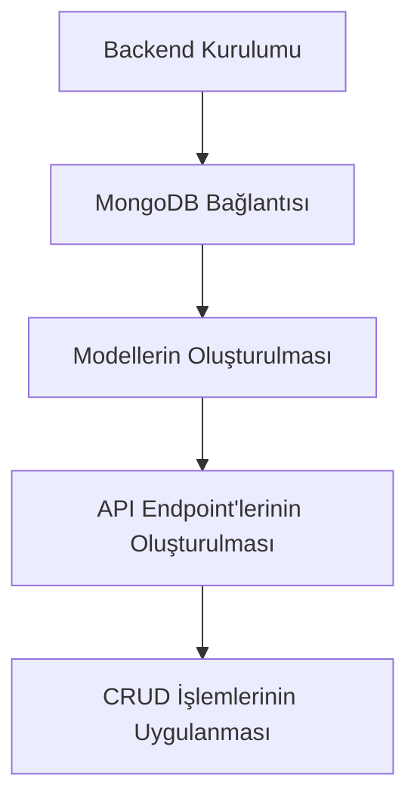
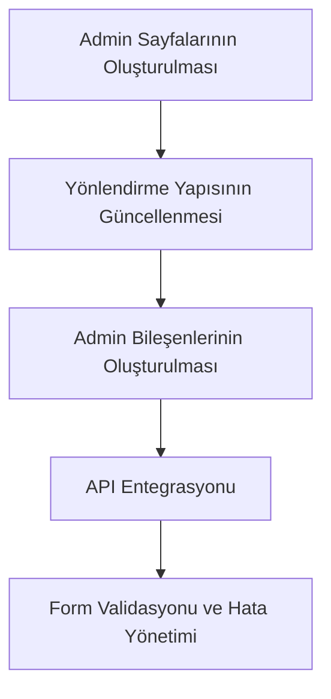
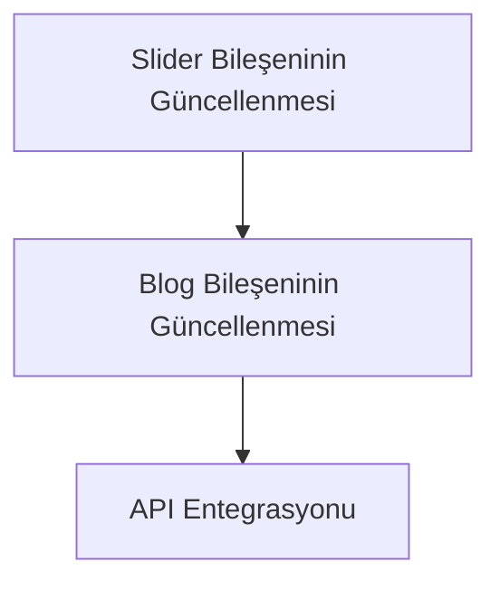

# Admin Paneli Oluşturma Planı

## Genel Bakış

Mevcut proje, React ve Vite kullanılarak oluşturulmuş bir web sitesi. Şu anda statik içeriklerle çalışıyor ve backend tarafı henüz oluşturulmamış. Admin paneli ile slider ve blog içeriklerini dinamik olarak yönetebilmek için hem backend hem de frontend tarafında geliştirmeler yapacağız.

## Tema Renkleri

Projenin mevcut tema renkleri:
- Ana renk: #000000 (siyah)
- İkincil renk: #f4fbd2 (açık sarı/yeşil)
- Nötr beyaz: #ffffff
- Nötr açık: #f5f5f5
- Nötr koyu: #333333
- Vurgu koyu: #2c2c2c

Bu renkleri admin panelinde de kullanarak tutarlı bir tasarım oluşturacağız.

## Proje Planı

### 1. Backend Geliştirme (MongoDB + Express.js)



#### 1.1. Backend Kurulumu
- Express.js kurulumu
- Gerekli paketlerin yüklenmesi (mongoose, cors, dotenv, vb.)
- Proje yapısının oluşturulması

#### 1.2. MongoDB Bağlantısı
- MongoDB Atlas hesabı oluşturma (veya yerel MongoDB kurulumu)
- Veritabanı bağlantı ayarlarının yapılandırılması

#### 1.3. Modellerin Oluşturulması
- Slider modeli:
  ```typescript
  interface Slide {
    id: string;
    imageUrl: string;
    title?: string;
    description?: string;
    buttonText?: string;
    buttonUrl?: string;
    order: number;
    isActive: boolean;
  }
  ```

- Blog modeli:
  ```typescript
  interface BlogPost {
    id: string;
    title: string;
    excerpt: string;
    content: string;
    imageUrl: string;
    category: string;
    date: Date;
    isPublished: boolean;
  }
  ```

#### 1.4. API Endpoint'lerinin Oluşturulması
- Slider için endpoint'ler:
  - GET /api/slides - Tüm slider'ları getir
  - GET /api/slides/:id - Belirli bir slider'ı getir
  - POST /api/slides - Yeni slider ekle
  - PUT /api/slides/:id - Slider güncelle
  - DELETE /api/slides/:id - Slider sil

- Blog için endpoint'ler:
  - GET /api/blogs - Tüm blog yazılarını getir
  - GET /api/blogs/:id - Belirli bir blog yazısını getir
  - POST /api/blogs - Yeni blog yazısı ekle
  - PUT /api/blogs/:id - Blog yazısını güncelle
  - DELETE /api/blogs/:id - Blog yazısını sil

### 2. Frontend Geliştirme (Admin Paneli)



#### 2.1. Admin Sayfalarının Oluşturulması
- Admin ana sayfa (Dashboard)
- Slider yönetim sayfası
- Blog yönetim sayfası

#### 2.2. Yönlendirme Yapısının Güncellenmesi
- React Router yapılandırmasına admin sayfalarının eklenmesi:
  ```jsx
  {
    path: '/admin',
    element: <AdminLayout />,
    children: [
      {
        index: true,
        element: <Dashboard />,
      },
      {
        path: 'sliders',
        element: <ManageSlider />,
      },
      {
        path: 'blogs',
        element: <ManageBlog />,
      },
    ],
  }
  ```

#### 2.3. Admin Bileşenlerinin Oluşturulması
- AdminLayout: Admin sayfalarının ortak düzeni
- Sidebar: Admin sayfaları arasında gezinme
- Dashboard: Genel bakış ve özet bilgiler
- ManageSlider: Slider ekleme, düzenleme, silme
- ManageBlog: Blog yazısı ekleme, düzenleme, silme
- Ortak bileşenler: Form, Tablo, Modal, vb.

#### 2.4. API Entegrasyonu
- API istekleri için servis fonksiyonlarının oluşturulması
- Veri alışverişi için React Hook'larının kullanılması (useState, useEffect)
- Form yönetimi için react-hook-form kullanımı

#### 2.5. Form Validasyonu ve Hata Yönetimi
- Form doğrulama kurallarının oluşturulması
- Hata mesajlarının gösterilmesi
- Başarılı işlem bildirimlerinin gösterilmesi

### 3. Mevcut Bileşenlerin Güncellenmesi



#### 3.1. Slider Bileşeninin Güncellenmesi
- Statik içerik yerine API'den gelen verilerin kullanılması
- Slider verilerinin dinamik olarak yüklenmesi

#### 3.2. Blog Bileşeninin Güncellenmesi
- Statik içerik yerine API'den gelen verilerin kullanılması
- Blog verilerinin dinamik olarak yüklenmesi

#### 3.3. API Entegrasyonu
- Veri alışverişi için servis fonksiyonlarının oluşturulması
- Veri yükleme durumlarının yönetilmesi (loading, error, success)

### 4. Dosya Yapısı

```
landing-page/
├── src/
│   ├── components/
│   │   ├── admin/
│   │   │   ├── Sidebar.jsx
│   │   │   ├── Sidebar.css
│   │   │   ├── AdminHeader.jsx
│   │   │   ├── AdminHeader.css
│   │   │   ├── SliderForm.jsx
│   │   │   ├── BlogForm.jsx
│   │   │   └── ...
│   ├── pages/
│   │   ├── Admin/
│   │   │   ├── AdminLayout.jsx
│   │   │   ├── AdminLayout.css
│   │   │   ├── Dashboard.jsx
│   │   │   ├── ManageSlider.jsx
│   │   │   ├── ManageSlider.css
│   │   │   ├── ManageBlog.jsx
│   │   │   └── ...
│   ├── services/
│   │   ├── api.js
│   │   ├── sliderService.js
│   │   └── blogService.js
├── server/
│   ├── config/
│   │   └── db.js
│   ├── models/
│   │   ├── Slide.js
│   │   └── Blog.js
│   ├── routes/
│   │   ├── slides.js
│   │   └── blogs.js
│   ├── controllers/
│   │   ├── slideController.js
│   │   └── blogController.js
│   └── server.js
```

## Uygulama Akışı

1. Kullanıcı `/admin` URL'sine gider
2. Admin paneli ana sayfası (Dashboard) görüntülenir
3. Kullanıcı sidebar'dan "Slider Yönetimi" veya "Blog Yönetimi" sayfasına gider
4. Kullanıcı mevcut içerikleri görüntüler, düzenler, siler veya yeni içerik ekler
5. Yapılan değişiklikler anında frontend'e yansır

## Teknoloji Seçimleri

- **Backend**: Express.js, MongoDB, Mongoose
- **Frontend**: React, React Router, React Hook Form
- **Stil**: CSS (mevcut tema renklerini kullanarak)
- **API İletişimi**: Fetch API veya Axios

## Zaman Çizelgesi

1. Backend kurulumu ve veritabanı bağlantısı
2. API endpoint'lerinin oluşturulması ve test edilmesi
3. Admin paneli sayfalarının ve bileşenlerinin oluşturulması
4. API entegrasyonu ve form işlevselliğinin eklenmesi
5. Mevcut bileşenlerin güncellenmesi
6. Test ve hata ayıklama
7. Dokümantasyon